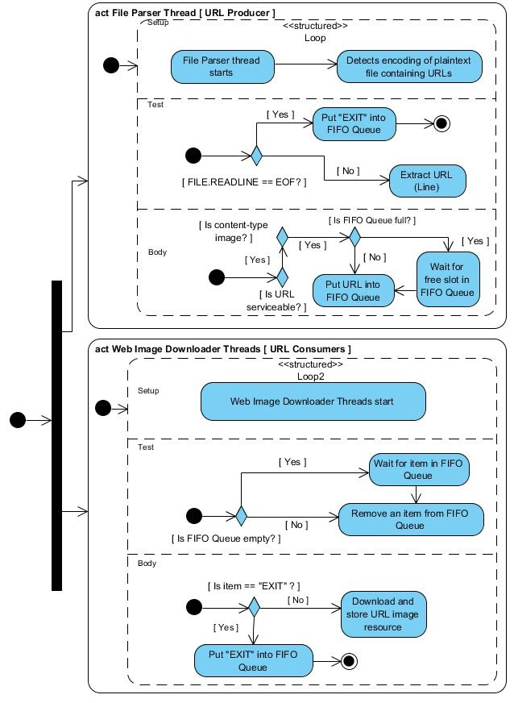

# File Parser - Web Image Downloader
This application takes a plaintext file as an argument which contains image URLs, one per line. The application parses the
plaintext file and downloads all serviceable image URLs, and finally stores them on user-defined location on the local hard disk.
 

## How to install the application software requirements
<code>$ cd image_downloader</code><br>
Choose only one of the below option (Read **_setuptools Note_** below):
* If you want to install and use the required packages:<br>
<code>$ sudo python setup.py install</code>
* Instead, if you don't want to install the required packages, however, still would like to just use them, then execute:<br>
<code>$ sudo python setup.py develop</code>

This application has been developed and tested on Ubuntu 16.04 LTS OS using Python 3.5.2. For other OS platforms, few instructions might need to be adapted.

**setuptools Note**: If _setuptools_ is not installed on your system, please execute these two instructions first, as 
_setuptools_ package is the prerequisite for _setup.py_ to work:<br>
<code>$ sudo apt install python-pip</code><br>
<code>$ sudo pip install setuptools</code>

## How to run the application
<code>$ cd image_downloader</code><br>
<code>$ export PYTHONPATH=$PWD</code>

###### Help on command-line options and arguments of the application:
<code>$ python scripts/run_parser_downloader.py -h</code><br>
```
usage: run_parser_downloader.py [-h] -f FILE_PATH
File Parser - Web Image Downloader
optional arguments:
  -h, --help            show this help message and exit
required arguments:
  -f FILE_PATH, --file FILE_PATH
                        Relative/Absolute path to the URLs containing plaintext file
```

<code>$ python scripts/run_parser_downloader.py -f <FILE_PATH></code> 

**Note 1**: _FILE_PATH_ is the absolute or relative(wrto _image_downloader_) system path to a plaintext file.<br>
Demo Run: <code>$ python run_parser_downloader.py -f ./image_urls.txt</code>

**Note 2**: By default, the downloaded images and generated application logs get stored in **_./downloaded_images_** and **_./logs_**
directory respectively. However, the application provides the users the flexibility to reconfigure the application as per their requisites. Please visit this
[subsection](#custom-configuration-settings-for-advanced-users) for custom configuration settings.

# How to execute unit tests for the application
<code>$ cd image_downloader</code><br>
<code>$ python -m unittest discover</code>

# How to produce code coverage report of the application
[*Only once:*] If _Coverage_ package is not installed on your system, please install this package [(version 4.5.1 with C extension)](http://coverage.readthedocs.io/en/coverage-4.5.1/index.html) in your local system:<br>
<code>$ pip install -U coverage</code><br>

<code>$ cd image_downloader</code><br>
<code>$ sh eval_code_coverage.sh</code>

**Note**: The produced code coverage report will get generated inside **_./documentation/coverage_html_report/_**. The
above executed shell script automatically opens the home HTML page (**_./documentation/coverage_html_report/index.html_**)
of application code coverage report.

## Custom Configuration Settings (For Advanced Users)
You can adjust the control settings of this tool by modifying "cfg.py". By default, every field is assigned some values.
Each field is explained below in this section. <br><br>
**Note 1**: Please be aware that _image_downloader_ is the home directory of this application. All relative addresses must be computed
relative to this directory only.

**Note 2**: For any invalid settings, default values will automatically get configured by the application.

* **IMAGE_SAVE_DIR**: Specifies the system path where downloaded files will get stored.
    * Expected value: Either absolute or relative file path in String format
    * Default value: _'./downloaded_images'_
    
* **URL_TIMEOUT**: Specifies waiting time (seconds) for a Request.  If you need to configure the application to wait for a response indefinitely, please assign None to it. You are strongly advised to configure a timeout value.
    * Expected value: Non-negative integer / None
    * Default value: _2_    
    
* **MAX_DOWNLOAD_REATTEMPTS**: Specifies the maximum number of reattempts to download an URL resource in case of first attempt download failure. Set it to None or 0, if you prefer not to reattempt. However, If _URL_TIMEOUT_ is
already set to None, application ignores this configuration.
    * Expected value: Non-negative integer / None
    * Default value: _2_    


* **SYSTEM_PROXY**: Using a dictionary (e.g; proxies below), it specifies mapping protocol or protocol and host to the URL of the proxy to be used on each Request. If your system is not behind a proxy, set it to None.
For detailed info, please visit [Request Proxies Details](http://docs.python-requests.org/en/master/user/advanced/#proxies).
    ```
          proxies = {
              'http': 'http://10.10.1.10:3128',
              'https': 'http://10.10.1.10:1080',
          }
  ```
        
     
    * Expected value: dictionary / None
    * Default value: _None_

* **LOG_DIR**: Specifies the system path where log files will get stored.
    * Expected value: Either absolute or relative file path in String format
    * Default value: _'./logs'_
 
* **LOG_LEVEL**:  Specifies the log level of the application.
    * Expected value: Available options are __"NOTSET"__, __"DEBUG"__, __"INFO"__, __"WARNING"__, __"ERROR"__, and __"CRITICAL"__. All these options are case-insensitive.
    * Default value: __"INFO"__


## Architecture for File Parser - Web Image Downloader
File Parser - Web Image Downloader uses the Producer / Consumer parallel-loop architecture. The design of File Parser - Web Image Downloader
is simple and elegant. It consists of two independent components: *File Parser* and *Web Image Downloader*.

File Parser does nothing but parse the plaintext file (taken as a command line argument) which contains image URLs, one per line and put the (*only*)
serviceable URLs into a FIFO queue. Web Image Downloader has four threads that fetch the serviceable URLs from the FIFO queue and download the
image resource. If a resource with the same name has already been downloaded priorly in the *IMAGE_SAVE_DIR* directory, then downloader threads
store the image resource with a new name without any race condition (for renaming). Once File Parser completes its operation, it puts
**"EXIT"** into the FIFO queue which is subsequently fetched by one of the threads of Web Image Downloader.
Once a thread of Web Image Downloader fetches **"EXIT"**, it puts **"EXIT"** into the FIFO queue again and exits.
 
The used pattern in this application uses some sort of asynchronous communications technique. Among the many advantages of this approach
is that it deserializes the required operations and allows both tasks (file parsing and downloading) to proceed in parallel.

<p align="center">
  
  <br>Activity Diagram of File Parser - Web Image Downloader<br>
</p>

## Future Extension / Optimization
* In future, if the list of URLs contains only certain sites, then from network connection point of view, 
it would be optimizable to only hit a single site with one request at a time (use a delay or send
all URLs per site to a single thread/process). Using a single thread/process per site can help save
the overhead of a three-way TCP handshake for HTTP persistent connections, however, this proposition is advisable only if you are performing multiple requests to the same host. Also, learn more about HTTP/1.1 request
pipelining and how to keep it alive.
* **A word of caution:** A very large thread pool size might quickly lead to diminishing application
performance based upon the configuration of your local system. I have employed one thread to parse the
file and four threads to perform multiple downloads at once. To make this application capable of
handling a massive list of URL downloads, it is advised to increase the number of download threads
(up to certain limit, 
 otherwise context switching among threads might lead to disparaging application performance).
 However, use more number of threads than the number of CPUs in your local system. That way, 
 the application can wait for many slow hosts at the same time.
* If you want to make this application capable of parallel execution on SMP and clusters, you can consider incorporating [parallel python](https://www.parallelpython.com/) into this application.
 * It is possible to extend the capability of this application to crawl the web for the user-defined type
of resources due to its modular architecture. If you implement this feature, please do make sure to
honor the sites [robots.txt](http://www.robotstxt.org/robotstxt.html), otherwise, the application
might likely get blocked pretty quickly by a single IP on a single site. [robotexclusionrulesparser](https://pypi.python.org/pypi/robotexclusionrulesparser) is 
a viable option to analyze robot.txt. A straightforward approach to avoid such blocking could be to
put a random sleep time in your crawler so that it does not multiple
requests in a very short timespan. You can also employ a priority queue to store/fetch the sites
(used by threads) and based upon an intelligent algorithm, the application might issue requests to a site. All of these approaches are only to outmaneuver the tarpit defense mechanism of a site.  
